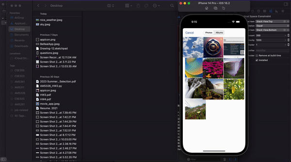
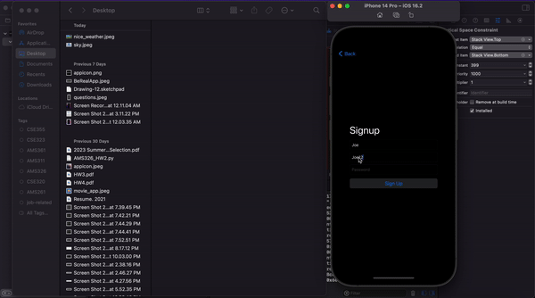

# Project 6 - *Be REal*

Submitted by: **Sabrina Zheng**

**Be Real** is an app that introduces posting photo feature, photo taking feature, login feature,and signup feature.

Time spent: **3** hours spent in total

## Required Features

The following **required** functionality is completed:

- [X] User can launch camera to take photo instead of photo library
        I did implement it and it works but just that I could show it with the simulator so I didn't open it. 
- [X] User session persists when application is closed and relaunched
- [X] Users are able to log out and return to sign in page
- [X] Users are NOT able to see other photos until they upload their own    
 
The following **optional** features are implemented:

- [ ] User receive notifcation when it is time to post
- [ ] Users can make comments and view comments in posts    

The following **additional** features are implemented:

- [ ] List anything else that you can get done to improve the app functionality!

## Video Walkthrough

Here's a walkthrough of implemented user stories:

 

Full video in the dropbox link:
https://www.dropbox.com/s/g2u8bduxgk5ejpq/video-walkthru.mov?dl=0

<!-- Replace this with whatever GIF tool you used! -->
GIF created with ezgif. 
<!-- Recommended tools:
[Kap](https://getkap.co/) for macOS
[ScreenToGif](https://www.screentogif.com/) for Windows
[peek](https://github.com/phw/peek) for Linux. -->

## Notes

Describe any challenges encountered while building the app.

## License

    Copyright 2023 Sabrina Zheng

    Licensed under the Apache License, Version 2.0 (the "License");
    you may not use this file except in compliance with the License.
    You may obtain a copy of the License at

        http://www.apache.org/licenses/LICENSE-2.0

    Unless required by applicable law or agreed to in writing, software
    distributed under the License is distributed on an "AS IS" BASIS,
    WITHOUT WARRANTIES OR CONDITIONS OF ANY KIND, either express or implied.
    See the License for the specific language governing permissions and
    limitations under the License.
